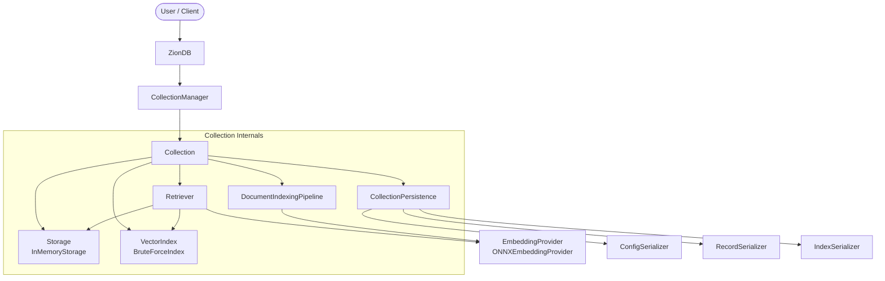
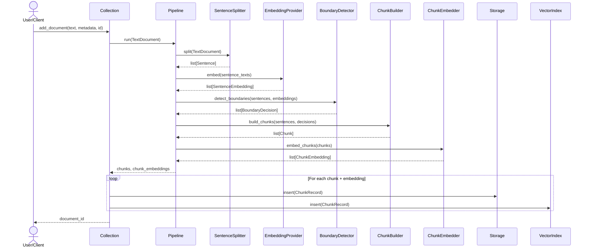
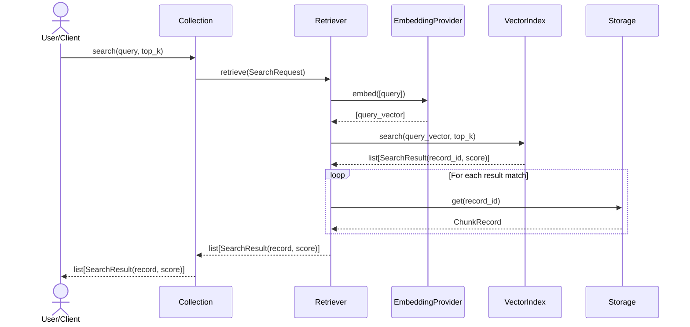
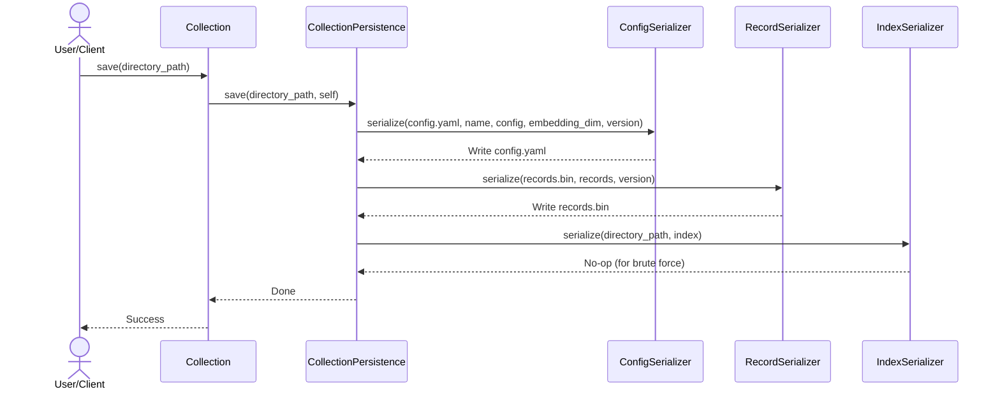

# ZionDB Architecture

ZionDB is a modular, custom vector database and retrieval engine designed from scratch for educational and production portfolios. This document describes the end-to-end architecture of ZionDB, detailing the public API entry points, isolation boundaries (collections), query orchestration (retriever), document indexing pipeline, and persistent storage serializers.

---

## Design Philosophy

1. **Separation of Concerns**: Each class has a single responsibility (e.g. tokenizer/embedder, distance metrics, binary disk IO, and index searching).
2. **Interface-Driven Design**: The orchestrators depend on abstract interfaces (like `Storage`, `VectorIndex`, and `EmbeddingProvider`), allowing alternative engines (HNSW) or persistence models (SQLite) to be plugged in.
3. **Data Integrity**: Structured domain models (`dataclasses` with `slots=True`) enforce strict typing, prevent schema validation bloat, and optimize memory footprints.

---

## High-Level System Architecture Layout

The overall architecture separates user coordination from internal search, ingestion, and storage layers. Each collection operates as a self-contained namespace owning its storage, indexes, and processing pipelines:



---

## Component Layout: Ingestion Pipeline

When documents are added to a collection, they parse sequentially through the stages of the `DocumentIndexingPipeline`:

```mermaid
graph TD
    doc[TextDocument] --> splitter[SentenceSplitter]
    splitter --> sentences[list[Sentence]]
    sentences --> embedder1[EmbeddingProvider]
    embedder1 --> sent_embs[list[SentenceEmbedding]]
    
    sentences --> detector[BoundaryDetector]
    sent_embs --> detector
    detector --> decisions[list[BoundaryDecision]]
    
    sentences --> builder[ChunkBuilder]
    decisions --> builder
    builder --> chunks[list[Chunk]]
    
    chunks --> embedder2[ChunkEmbedder]
    embedder2 --> chunk_embs[list[ChunkEmbedding]]
    
    chunk_embs --> output[ChunkRecord & ChunkEmbedding]
```

---

## Interaction Flows

### 1. Document Ingestion Flow
This flow details how raw documents are converted into searchable, embedded chunk records and synchronized across storage and search indices:



### 2. Semantic Search Flow
This flow illustrates the query path where Retriever translates a search query, queries the vector index, resolves records, and yields clean results:



### 3. Collection Persistence Flow
This flow tracks saving collection configurations and records to disk:



---

## Component Responsibilities

### 1. Document Indexing Pipeline (`DocumentIndexingPipeline`)
- Coordinates the stages of the pipeline.
- Handles edge cases (such as empty texts or single sentences) before invoking heavy components.

### 2. Sentence Splitters (`SentenceSplitter`)
- **`RegexSentenceSplitter`**: Split sentences using punctuation rules and regex patterns.
- **`SpacySentenceSplitter`**: Splits sentences using spaCy's optimized rule-based `sentencizer`.
- Both extract exact character ranges (`start_char`, `end_char`) matching the original source text.

### 3. Model Manager & Embedding Providers (`ModelManager`, `EmbeddingProvider`)
- **`ModelManager`**: Handles downloading model files, local cache directories (`models/`), and initializing the CPU-bound ONNX session.
- **`ONNXEmbeddingProvider`**: Tokenizes input text strings, runs the ONNX model, performs Mean Pooling, applies L2 Normalization, and yields normalized embeddings of size 384.

### 4. Boundary Detector (`BoundaryDetector`)
- **`KamradtBoundaryDetector`**: Groups consecutive sentences, calculates cosine distances between adjacent groups, and flags semantic topic transitions.

### 5. Chunk Builder (`ChunkBuilder`)
- **`SemanticChunkBuilder`**: Assembles sentences into final `Chunk` objects using boundary splits.

### 6. Chunk Embedder (`ChunkEmbedder`)
- **`ONNXChunkEmbedder`**: Computes the final embedding vectors for the generated chunks.

### 7. Collection (`Collection`)
- The main engine driver. Handles document insertions, indexing orchestrations, and forwards queries to the retriever. Owns storage, index, and retriever instances.

### 8. Retriever (`Retriever`)
- Orchestrates semantic search queries. Generates query embeddings, searches the vector index, retrieves chunk records, and returns public SearchResult models.

### 9. CollectionManager & ZionDB (`CollectionManager`, `ZionDB`)
- Coordinates active collection instances and exposes the primary public database API.

### 10. Collection Persistence Orchestration (`CollectionPersistence`)
- Coordinates directory operations and calls appropriate config, record, and index serializers. Uses a dynamic registry mapping configured index types to specific serializers.

### 11. Serializers (`ConfigSerializer`, `RecordSerializer`, `IndexSerializer`)
- **`ConfigSerializer`**: Writes/reads collection settings to/from `config.yaml`.
- **`RecordSerializer`**: Serializes/deserializes chunk records to/from a versioned binary `records.bin` using a little-endian Length-Value design.
- **`IndexSerializer`**: Abstract interface for vector search indices (concrete `BruteForceIndexSerializer` performs a rebuild during load).
